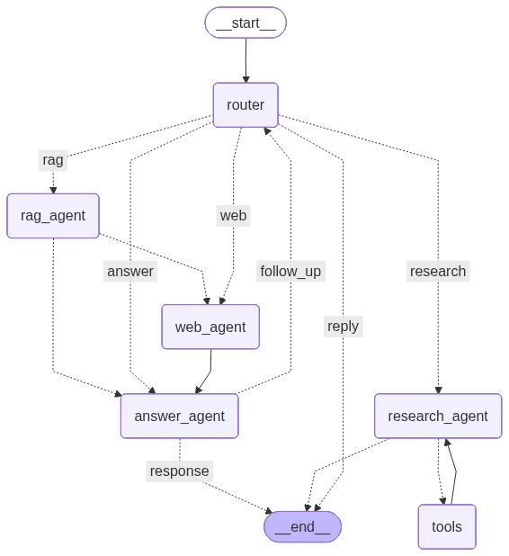

# Multi-Agentic LLM Orchestration
This project implements a production-style agentic AI system that dynamically routes user queries across multiple specialized agents using a graph-based execution model. Built with LangGraph, LangChain, and LangSmith, the system demonstrates how modern LLM applications can move beyond single-prompt chatbots toward modular, tool-aware, and observable AI workflows.

At the core of the system is a Router Agent that analyzes each user query and, at runtime, decides whether to handle it via real-time web search, Retrieval-Augmented Generation (RAG), or multi-step research using external tools. A dedicated agent handles each responsibility, and the final response is synthesized by an Answer Agent, ensuring clarity and reliability.

The entire workflow is orchestrated using LangGraph’s conditional state transitions, making the system easy to extend, debug, and evaluate. A Streamlit-based UI provides an interactive interface, while LangSmith integration enables full observability, tracing, and performance analysis of agent decisions and tool usage.

Modern LLM applications often fail when a single agent is forced to handle
retrieval, web search, reasoning, and response generation simultaneously.

The project explores a modular, **graph-based agentic architecture** where:
- Queries are dynamically routed
- Specialized agents handle distinct responsibilities
- Tools are invoked only when needed
- The entire workflow is observable and debuggable

The goal was to design an *extensible, production-oriented agent system* rather than a single prompt-based chatbot!!


## 🧩 Agent Workflow



## ⚙️ Workflow Overview

1. **Router Agent**
   - Understands and routes incoming queries to other agents.
   - Decides whether RAG, web search, or research is required, else answer.

2. **RAG Agent**
   - Handles knowledge-grounded queries.
   - Uses vector search retrieval from Pinecone vectorstore for contextual answers.

3. **Web Agent**
   - Performs real-time web searches using different search tools.
   - Useful for recent or dynamic information.

4. **Research Agent**
   - Executes multi-step reasoning and prepares research report on the given topic.
   - Uses external tools for deeper analysis

5. **Answer Agent**
   - Synthesizes final output from the available context
   - Produces a final, coherent response


## ⭐ Key Features
- **Stateful Agent workflow**: Implemented the entire workflow as a stateful graph with conditional transitions, enabling clear control flow, extensibility, and debuggability.
- **Multi-Agent Coordination**: Coordinates multiple specialized agents, allowing agents to collaborate, pass intermediate results, and contribute to a unified final response.
- **Tool-Augmented Reasoning with ReAct framework**: Agents can invoke external tools such as web search to enhance factual accuracy and reasoning depth.
- **Agent-Orchestrated Adaptive RAG (Retrieval-Augmented Generation)**: Uses a Router Agent to dynamically decide whether a query requires looking into external database provided, web search, or multi-step research—avoiding unnecessary RAG calls.
- **Separation of Concerns in LLM Systems**: Separates responsibilities such as routing, retrieval, tool usage, and response synthesis across dedicated agents, improving maintainability, scalability, and modular design.
- **Observability with LangSmith**: Full visibility into agent decisions, tool calls, and execution paths for debugging and evaluation.


## 🏗️ Tech Stack
1. **LangGraph** – Defines the agentic workflow as a stateful graph with conditional routing and execution paths.
2. **LangChain** – Provides abstractions for agents, tools, prompts, and LLM interactions.
3. **LangSmith** - End-to-end tracing, debugging, and evaluation of agent decisions, tool calls, and execution paths.
4. **LLMs** – GPT-OSS-20b, GPT-OSS-120b, Gemini-2.5-flash, GoogleGenerativeAIEmbeddings
5. **Databases** - Pinecone, SqlLite.
6. **Custom Tools** – Modular tool interfaces for different tasks.
7. **Streamlit** - Interactive web-based UI for real-time user interaction with the agentic system.

<b> 📍 All open source tools and free tier services have been used to develop this application!! 🙏✨</b>

## Installation

STEP: 01 - Clone this repository

```cmd
git clone https://github.com/SubinoyBera/AgentFlow
cd ToxicTweet-Tagger
```

STEP: 02 - Create and activate conda environment

```bash
conda create -p venv python=3.11.5 -y
conda activate venv
```

STEP: 03 - Install project requirements. <br>

```bash
pip install -r app/requirements.txt
```

STEP: 4 - Setup the `.env` file and add your API keys in the environment variables as specified in `.env.example`

STEP: 5 - Run the Application

```bash
streamlit run app.py
```

Open your browser and open the local URL : `http://localhost:8501/`.<br>

## 

